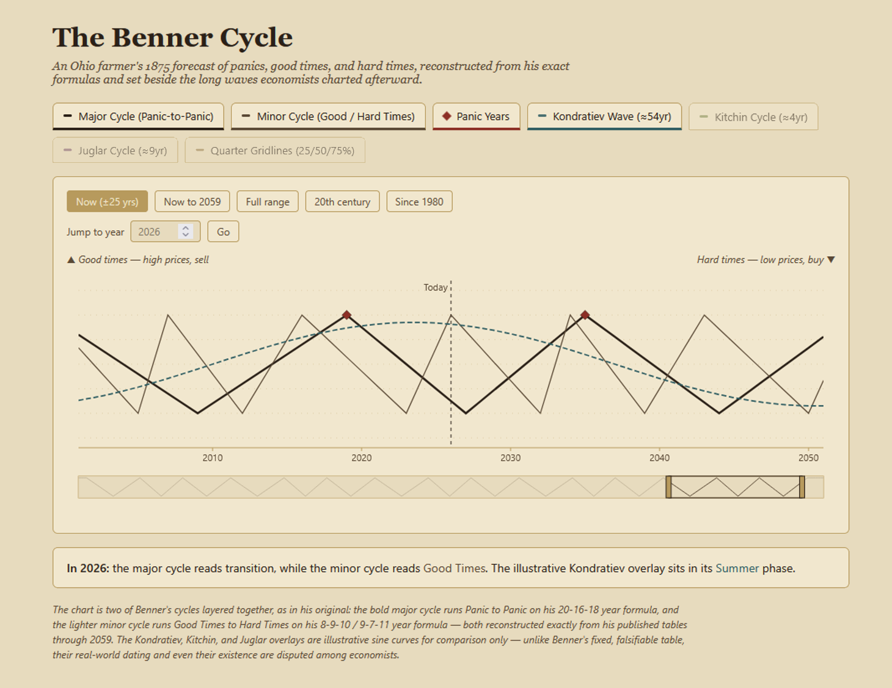

# The Benner Cycle Viewer

Interactive chart reconstructing Samuel Benner's 1875 economic cycle forecasts through 2059, with Kondratiev/Kitchin/Juglar wave overlays for comparison.

**[Download v0.1](https://github.com/TheBlackTemple/benner-cycle-viewer/releases/download/v0.1/benner.zip)** — no build needed, just open the HTML file.

## What it is

In 1875, an Ohio farmer named Samuel Benner published *Benner's Prophecies of Future Ups and Downs in Prices*, a set of tables predicting future "panics," good times, and hard times based on patterns he'd observed in 19th-century markets. This viewer reconstructs his forecast exactly from those published formulas — it's not a judgment on whether the method works, just a faithful, calculable rendering of what he actually claimed, set alongside the longer economic cycles (Kondratiev, Kitchin, Juglar) that economists proposed later, for comparison.

It's a viewer, not an explorer: there's nothing to simulate or adjust, just a fixed historical reconstruction with controls for navigating it.

## Features

- **Major cycle** — Panic-to-Panic, using Benner's 20-16-18 year formula
- **Minor cycle** — Good Times-to-Hard Times, using his 8-9-10 / 9-7-11 year formula
- Both calculated exactly through 2059, not approximated
- Kondratiev / Kitchin / Juglar overlays, shown as illustrative sine curves for comparison only
- Year range presets and jump-to-year search
- Toggleable legend layers

## Usage

No build step, no dependencies. [Grab the latest release](https://github.com/TheBlackTemple/benner-cycle-viewer/releases/download/v0.1/benner.zip) and open `index.html` in a browser — or clone the repo and do the same.

## A note on accuracy

Benner's table is fixed and falsifiable — either the historical dates line up with his predictions or they don't. The Kondratiev, Kitchin, and Juglar overlays are different: their real-world dating, and in some cases their existence as regular cycles at all, is disputed among economists. They're included here for visual comparison, not as validated alternatives.

## License

MIT License with a [Commons Clause](LICENSE) restriction — free to use, modify, and distribute, but you can't sell the software or a derivative of it without permission.